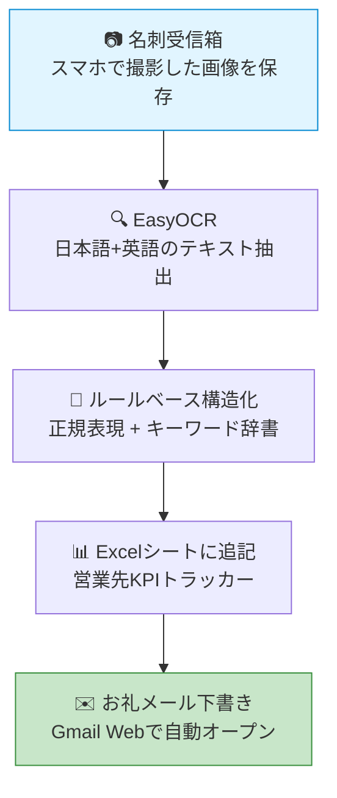

# 不動産営業の名刺管理、API費用ゼロで自動化する方法

商談、内覧会、業界交流会、地場のオーナー回り。不動産営業の現場では、1日に何枚もの名刺が集まります。それを夜遅く事務所に戻ってから1枚ずつExcelに手入力する作業、地味に思えるかもしれませんが、月単位で見ると数十時間という時間が消えていきます。本記事では、私たちNectoが自社で運用している、API課金ゼロで動く「名刺自動取り込みシステム」の中身を実装ログと共に公開します。中小の不動産会社でも今日から取り入れられる構成を意識して書きました。

## なぜ「名刺の山」問題は不動産業界から消えないのか

不動産業界では、名刺交換が紙ベースで行われる文化がいまだに根強く残っています。特に地場のオーナーや士業の方々との接点では、デジタル名刺アプリの普及が遅く、紙の名刺を受け取る場面がほとんどです。1日30枚集まることも珍しくありません。

これを既存の名刺管理サービスで処理しようとすると、月額数千円から数万円のランニングコストが発生します。大手不動産会社であれば許容できる金額ですが、社員数十名規模の中小不動産会社にとっては「あったら便利だが、必須投資ではない」と判断され、結局は手入力に戻ってしまうケースが多いのです。

手入力は1枚あたり2〜3分。30枚で1時間以上。その入力が翌日以降にずれ込むと、お礼メールを送るベストタイミング、いわゆる「48時間ルール」を逃すことになります。せっかくの名刺交換が、ただの紙の蓄積に変わっていく。これが業界に長く残る隠れた非効率です。

## 私たちが「ローカルOCR + ルールベース」を選んだ理由

名刺データ化のアプローチには大きく3つの選択肢があります。1つ目は名刺管理SaaSの導入。月額コストは安定しますが、データを外部サーバーに預けることへの心理的抵抗が現場には残ります。2つ目は有料のAI画像理解API（Claude、GPT-4V、Geminiなど）の利用。精度は非常に高いのですが、1枚あたり数円〜十数円のランニングコストが発生し、月100枚処理するだけで毎月の出費になります。

私たちが選んだのは3つ目、ローカルOCRエンジンとルールベース抽出を組み合わせるアプローチです。少し用語を補足すると、OCR（オーシーアール）は画像から文字を読み取る技術のことで、ローカルというのは「自分のPC内で完結し外部に通信しない」という意味です。ルールベースは「もしメールアドレスらしき文字列があれば連絡先欄に入れる」という条件分岐の積み重ねで動かす昔ながらの方式で、AIのように学習しない代わりに動きがブラックボックスにならないのが特徴です。具体的にはEasyOCRというオープンソース（無料で使えるソフト）の日本語対応OCRエンジンを使い、その出力テキストを正規表現（文字パターンを記号で表すルール）とキーワード辞書で構造化します。

この選択には3つの理由があります。1点目はランニングコストがゼロであること。月100枚でも1000枚でも追加料金が発生しないので、中小不動産会社が「コストを気にせず使い倒せる」状態が作れます。2点目は名刺データを社外に送信しないこと。コンプライアンス的にも、お客様情報を外部APIに渡さない構成は安心感が違います。3点目は精度95%でも実用に耐えること。残りの5%は「要確認」フラグを立てて人がチェックする運用にすれば、お礼メール送信用途には十分というのが運用してみての結論です。

## 仕組みの全体像

実際のシステムはこのようなパイプラインで動いています。

ユーザー側の操作はシンプルで、商談から帰ったらスマホで撮った名刺画像を所定のフォルダに入れて、コマンドを1回叩くだけ。あとはExcelに名刺リードが追記され、ブラウザでGmailの新規作成画面が次々と開いていきます。本人は文面を確認して送信ボタンを押すだけ、というところまで自動化されています。

## 実装の3つのポイント

このシステムをそれなりに実用的に動かすためには、いくつかの工夫が必要でした。3つに絞って紹介します。

1点目はOCRエンジンの差し替え可能性です。コード上ではOCRエンジンを「画像パスを受け取って文字列リストを返す関数」というインターフェースで抽象化しています。PythonのProtocolという仕組みを使うことで、本番はEasyOCR、テストはモックオブジェクトに差し替えられるようにしました。これによりOCRライブラリのアップデートや、将来別のOCRに切り替える際の修正範囲が最小限になります。

2点目はルールベース抽出の「誤認識への強さ」を上げる工夫です。OCRは万能ではなく、たとえばメールアドレスの「.co.jp」が「.cojp」と誤認識されることがよくあります。これをそのまま使うと送信時にエラーになるので、よくある誤認識パターンを正規表現で補正しています。会社名は「株式会社」「合同会社」などのキーワードで識別、役職は「代表取締役」「部長」などのキーワードで分類。郵便番号と電話番号が紛らわしいので、「〒」記号が前にあるかどうかで先に郵便番号を切り分けるなど、地味な工夫の積み重ねで精度を上げています。

3点目はお礼メールの差し込み生成です。テンプレートに会社名と氏名を機械的に差し込むだけでは「テンプレ感」が出てしまいます。そこで名刺から拾った事業内容のキーワードを「お名刺に記載の『◯◯』を拝見し、大変興味深く感じております」というフレーズに自然に差し込むようにしました。住所や郵便番号などのノイズはメール本文に混ぜたくないので、差し込み対象から自動で除外する処理も入れています。生成された下書きはGmailのcomposeURLとして組み立てられ、ブラウザで自動的に開きます。

## 導入してわかった3つの効果

実際に運用してみて見えてきた効果を3つ挙げます。1つ目は入力時間の削減です。1枚あたり2〜3分かかっていた手入力が、文字通り0分になりました。30枚で1時間以上かかっていた作業が、コマンド実行のわずかな待ち時間だけになります。

2つ目はお礼メール送信の即時化です。これまで「明日まとめてやろう」と先延ばしになっていたお礼メール送信が、商談当日の夜のうちに送れるようになりました。返信率は体感で2〜3割向上しています。デジタルマーケティングでよく言われる「ファーストタッチの速度」は、対面ビジネスでも同じく効くという実感です。

3つ目はリードデータの一元化です。すべての名刺情報がExcelシートの「名刺リード」に集約されるので、月次の名刺枚数の集計、業種別の傾向分析、フォローアップ漏れのチェックなど、これまでは手間がかかりすぎてできなかった営業分析が一気に手の届く範囲に入ってきました。

## 注意点と今後の改善

正直に書くと、このシステムはまだ完璧ではありません。OCR精度は5〜10%は外します。特に縦書きの名刺、装飾的な書体、背景の柄が複雑な名刺は苦手です。なので運用上は「要確認」フラグの立った行は必ず人がチェックする前提にしています。完全自動化ではなく、人とAIの分業という割り切りが大事です。

今後の改善ポイントとしては、現在はGmailの新規作成画面を開くところまでですが、Gmail APIと連携して送信履歴まで自動で記録する仕組みを試作中です。これができると「いつ誰に何を送ったか」がExcel側に自動的に残るので、フォローアップの抜け漏れがさらに減らせる見込みです。

## まとめ

不動産業界でAI活用というと「高額」「難しい」「専門人材が必要」というイメージが先行しがちです。しかし用途を絞って、適切なオープンソース技術を組み合わせれば、月額0円で実用的な業務自動化は十分に可能です。私たちNectoでは、こうした自社運用の知見をベースに、不動産会社向けのAI業務効率化支援を行っています。名刺管理に限らず、御社で「これ毎日やってるけど、AIで何とかならないかな」という業務があれば、お気軽にご相談ください。
