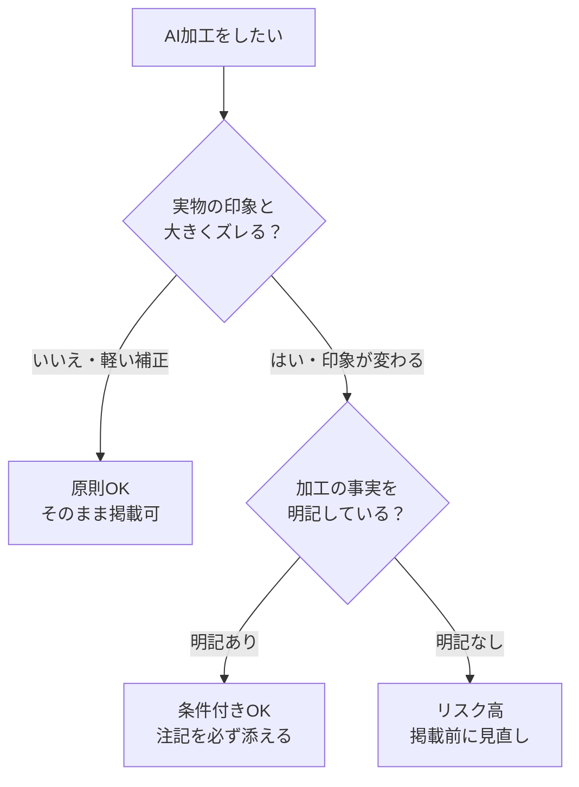

空室をきれいに見せたい——その気持ちは当然です。最近はAI（人工知能）で物件写真を明るくしたり、何もない部屋に家具を合成したり（バーチャルステージング＝室内に家具を仮想的に置いて見せる手法）が手軽にできるようになりました。

ですが、見栄えを良くしすぎると「**おとり広告」「誇大広告」とみなされ、掲載停止や行政指導につながる**おそれがあります。本記事では、よくある疑問をQ&A形式で整理し、安全に使うためのラインを示します。

## Q. AIで写真を明るくするのはダメなの？

明るさや色味の軽い補正そのものは、一般的に問題になりにくい範囲です。問題になるのは、**実物と印象が大きく変わってしまう加工**です。たとえば、北向きの暗い部屋を日当たり良好に見せる、古い設備を新品のように描き替える、といった「事実と異なる印象」を与える加工は、景品表示法（不当な表示を禁止する法律）や不動産の公正競争規約に触れるおそれがあります。

もう少し具体的に見てみましょう。曇りの日に撮った写真の明るさを少し上げる、白い壁の色味を実物に近づける、といった補正は、実際の部屋の印象とほぼ変わらないため、一般的に問題になりにくい範囲です。一方で、窓の外に実在しない景色を合成する、構造上ありえない広さに見えるよう加工する、設備のサビや汚れを消して新品同様に見せる、といった加工は「お客様の判断を誤らせる」方向に働きます。同じ「加工」でも、実物に近づける方向か、実物から遠ざける方向かで意味がまったく変わります。この「向き」の違いを意識するだけで、迷う場面はぐっと減ります。

また、この考え方は写真だけでなく、間取り図やキャッチコピーにも当てはまります。「駅徒歩◯分」「日当たり良好」といった表現も、実態と離れれば誇大広告になり得ます。AI加工をきっかけに、物件情報全体を「実物に正直か」という目で一度見直してみると、思わぬ思い込み表現に気づけることがあります。判断に迷ったら「この写真しか見ていないお客様が、現地で同じ印象を受けるか」を自問するのが確実です。

## Q. バーチャルステージング（家具の合成）は使ってもいい？

使えますが、**「これは家具を合成した加工画像です」と分かるように明記する**のが基本です。家具はあくまでイメージであり、実際には付いてこない、という事実が誤解なく伝わる必要があります。注記なしで生活感のある写真を載せると、入居後に「話が違う」というトラブルの火種になりかねません。

## Q. どこからが「やりすぎ」なの？

判断の軸はシンプルです。**「現地を見たお客様がガッカリするかどうか」**。下の図のように考えると整理しやすくなります。

## Q. 掲載前のチェックはどうすれば？

おすすめは、**「加工した点」と「注記の有無」を1枚のチェックリストで残す**運用です。誰がどの写真をどう加工したかを記録しておけば、ポータルサイト（物件情報の掲載サイト）側の審査や、万一の指摘にも落ち着いて対応できます。こうした地味なチェックの仕組み化こそ、[中小不動産会社こそ、AIで大手に勝てる時代へ](/articles/small-real-estate-firms-can-win-with-ai)つながる強みになります。

## Q. ポータルサイトがAI画像を見分けるって本当？

本当です。近年は物件情報の掲載サイト側でも、AIで生成・加工された画像を見分けて表示を制限する動きが広がっています。つまり「バレなければ大丈夫」という発想は、もう通用しなくなりつつあります。隠すのではなく、最初から「加工した事実を明記する」ほうが、結果的に掲載も安定します。

あわせておすすめなのが、**加工前の写真を必ず保管しておく**ことです。元データと加工後をセットで残しておけば、万一「実物と違う」と指摘されても、どこをどう補正したかを説明できます。なお、退去後の清掃済みに近づける程度の整え（小さなゴミの除去など）は実物の印象を大きく変えない範囲なら許容されやすい一方、傷んだ壁や古い設備を新品のように描き替えるのは「印象を変える加工」にあたるため避けるべきです。

## 社内で決めておきたい「加工ルール3カ条」

担当者によって加工の基準がバラつくと、思わぬところで事故が起きます。次の3つを紙1枚にまとめ、写真を扱う全員で共有しておきましょう。

1. **明るさ・色味の軽い補正はOK**。ただし実物の印象を変えない範囲にとどめる
2. **家具の合成（バーチャルステージング）は必ず注記する**。「イメージです」と分かるようにする
3. **加工前の写真を必ず保管する**。後から説明できる状態を残す

派手さはありませんが、こうして仕組みで守ることが、結果的にいちばんの信頼づくりになります。AIは「映え」を作る便利な道具です。だからこそ、使い方のルールを先に決めておけば、安心して活用できます。

## まとめ

AI加工は「映え」を作る道具であると同時に、使い方を誤ると信頼を損なう道具でもあります。**「軽い補正はOK・印象を変える加工は注記必須・実物とのズレは厳禁」**——この3点を社内ルールにしておけば、安心して活用できます。AIを業務に取り入れる際の確認姿勢という点では、[重要事項説明の『AI下書き』が解禁へ](/articles/real-estate-disclosure-ai-draft)の「人が最終確認する」考え方とも共通しています。

---

### 参考にした情報源
- 不動産業界のAIホームステージング・バーチャルステージング導入に関する報道
- 景品表示法・不動産の表示に関する公正競争規約（一次情報の確認を推奨）
