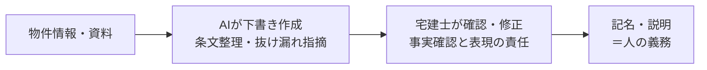

「重要事項説明書（重説）の作成は、神経も時間も使う仕事」——多くの宅建士の方がそう感じているのではないでしょうか。物件ごとに条文を確認し、誤りがないか何度も読み返す。ここにAI（人工知能、文章を作ったり要約したりする技術）を使ってよいのか、気になっている方も増えています。

結論から言えば、**AIは「下書き役」としては有効に使えますが、最終的な確認と説明の責任は宅建士が負う**、という線引きが基本です。本記事では、いま国がどう動いているのかを整理しつつ、現場で安全にAIを取り入れる第一歩までをまとめます。

## まず結論：AIは「たたき台」、判断は人

重説は宅地建物取引業法（宅建業法）にもとづき、宅建士が記名・説明する義務がある書類です。つまり**説明責任は人にひもづいており、これはAIに肩代わりさせられません**。

一方で、説明書の「下書きを作る」「条文の抜け漏れを指摘する」「過去の書類と表現をそろえる」といった準備作業は、AIが得意とする領域です。重説そのものを丸ごとAIに任せるのではなく、**人がやるべき確認の前段を軽くする**——この使い分けが現実的です。

## いま何が起きているのか

2026年に入り、行政側でも業務へのAI活用に向けた動きが広がっています。たとえば国土交通省は、建設・インフラ分野などで生成AIの実証や活用方針づくりを進めています。ただし、これは重要事項説明そのものをAIで全自動化してよい、という制度ができたという話ではありません。あくまで「人の確認を前提とした補助」としてどこまで使えるか、という議論が始まった段階だと捉えるのが正確です（重説に関する具体的な制度・対象範囲は一次情報の確認が必要です）。

ポイントは、「AIで重説の作成を全自動化してよい」という話ではない、ということです。あくまで**人の確認を前提とした補助**として、どこまで使えるかの輪郭が描かれつつある段階だと捉えるのが安全です。

海外に目を向けても、AIは契約書類の「下書き」や「誤りの洗い出し」に広く使われ始めていますが、最終的に内容を保証するのは人、という原則は共通しています。日本の重説も同じ流れの中にあると考えると、過度に身構える必要はありません。大切なのは、解禁の有無に一喜一憂することではなく、「どこまでAIに任せ、どこは人が責任を持つか」という自社の線引きを、いまのうちに言葉にしておくことです。準備をしておけば、ルールが整ったその日から、迷わず使い始められます。

## AIに任せられる部分／人が必ず見る部分

業務を「下ごしらえ」と「最終確認」に分けて考えると、線引きがはっきりします。

- **AIに任せやすい**：定型文の下書き、過去書類との表現統一、記載漏れの一次チェック、難しい用語の言い換え案
- **人が必ず行う**：登記・法令・現地に関する事実確認、リスクの説明、記名と口頭説明

「AIが出した文章をそのまま使う」のではなく、「AIがそろえた素材を人が点検する」。順番を逆にしないことが、トラブルを防ぐ最大のコツです。

## 現場で今日からできる第一歩

いきなり重説本体に使うのは不安、という場合は、リスクの低いところから試すのがおすすめです。

1. まずは社内向けのメモや案内文の下書きでAIに慣れる
2. 重説では「最終チェックリストの作成」など、間接的な補助から始める
3. 顧客情報などの機微な情報は入力しない運用ルールを先に決める

私たちNecto編集部自身も、社内文書のたたき台づくりにAIを使う際は、必ず人の確認を一段はさむ運用を徹底しています。

## よくある3つの不安と、その答え

重説へのAI活用を前に、現場でよく聞く不安を3つ取り上げます。

- **「AIが間違えたら誰の責任？」** 説明と記名をするのは宅建士です。責任の所在はAIを使っても変わりません。だからこそAIの出力を鵜呑みにせず、人が必ず確認する——この前提は崩せません。逆に言えば、確認さえ徹底すれば、下書きづくりは安心して任せられます。
- **「導入にお金がかかるのでは？」** まずは既存の対話型AIで下書きを作るだけなら、大きな初期投資は要りません。専用のシステムは、効果を確かめてから検討すれば十分です。小さく始めるほど、うまくいかなくても痛手が小さくて済みます。
- **「年配のスタッフには難しいのでは？」** 最初は「指示文（プロンプト＝AIへの指示の文章）を1つ社内で共有する」ところから始めましょう。全員が同じ型を使えば、習熟の差は小さくできます。一人が試して良かったやり方を、そのまま横展開するイメージです。

## 失敗しない導入ステップと、浮いた時間の使い道

いきなり本番の重説で使うのは避け、リスクの低い順に広げるのが安全です。

1. まず一人が、社内向けの案内文など「外に出ない文章」でAIの下書きに慣れる
2. 慣れたら、重説の「最終チェックリスト作成」など間接的な補助に広げる
3. 効果を感じたら、入れてよい情報のルールを決めて本格運用に進む

順番を飛ばさないことが大切です。下ごしらえが軽くなって宅建士の時間が空いたら、その時間は「お客様への説明の質」に振り向けましょう。書類づくりという作業はAIが担い、人は「分かりやすく伝える」「不安を解消する」という人にしかできない仕事に集中する——これが、AI活用の本当の狙いです。

## まとめ

重説へのAI活用は「全自動化」ではなく「下書き＋人の確認」が出発点です。国の整理が進むこのタイミングで、**自社の運用ルール（どこまで任せ、どこは人が見るか）**を先に決めておくと、解禁の流れに慌てず乗れます。どの業務からAIに置き換わっていくのか全体像を知りたい方は、[AIエージェント元年、不動産で『置き換わる業務』とは](/articles/ai-agent-era-real-estate-jobs-changing)もご参照ください。

---

### 参考にした情報源
- 国土交通省による建設・インフラ分野等での生成AI実証・活用方針に関する報道（重要事項説明への適用可否は一次情報の確認を推奨）
- 各都道府県宅建協会のAI活用検証に関する案内
